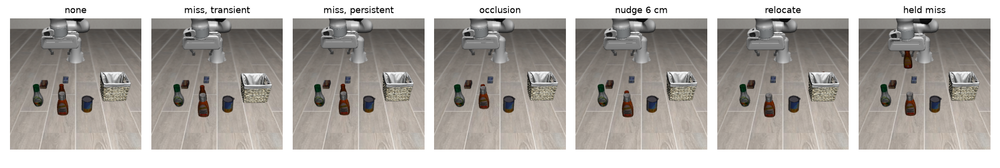

# 분기 실험 파일럿 보고서

Oct 6, 2026 · 코드 기준 커밋 `884dc7b`

## 1. 요약

- **결과가 이제 운이 아니라 정보로 정해진다.** 최종 파일럿은 상태 44개에서 네 개입과 단계적 확대를 20회씩, 모두 4,400회 실행했다. 그중 결과가 갈린 칸은 220칸 가운데 하나였다. 첫 파일럿에서는 100칸 가운데 32칸이 갈렸다.
- **원인마다 최선 개입이 갈린다.** 네 개입 모두 적어도 한 원인에서 유일한 최선이다. 원인을 아는 정책의 손실이 상태별 최선과 같았다.
- **사실 목록만으로는 원인을 가를 수 없다.** 판단 시점의 사실 목록 하나가 네 원인에 걸친 일곱 상태에서 똑같이 나왔고, 그 상태들의 최선 개입은 세 가지였다.
- **위험만 쓰면 상태당 2.4초를 더 쓴다.** 원인을 아는 정책보다 23% 많다. 방해를 처리하는 데 든 시간만 보면 거의 두 배다.
- **단계적 확대가 그 손해의 대부분을 되찾는다.** 위험이 높을 때만 확대하는 정책은 원인을 아는 정책보다 1.0초 더 쓴다.
- **손해의 크기는 우리가 정한 비용으로 정해진다.** 위험만 쓰는 정책의 손해는 재계획 비용과 실패 벌점에 따라 0.1초에서 19초까지 움직인다. 단계적 확대의 손해는 그 범위에서 약 1초로 거의 일정하다.

## 2. 실험 설정

### 과제와 실행기

- **과제**: LIBERO-Object 3번 과제, 바비큐 소스를 집어 바구니에 넣기.
- **실행기**: 접근, 확인, 내려가기, 잡기, 들기, 운반, 내려놓기, 놓기를 스크립트로 고정했다. 시뮬레이터의 정답 대신 잡음이 섞인 관측으로 만든 믿음을 보고 움직인다.
- **확인 규칙**: 실행기는 대상 위에 도착한 뒤의 관측이 대상을 보고해야 내려간다. 계속 실행은 고정 카메라의 정해진 관측을 기다린다. 정해진 관측은 단계에 들어설 때와, 한 단계에 4초간 머물러 정체로 판정될 때 한다. 국소 복구와 재계획 뒤에는 손목 카메라로 확인한다.
- **관측 잡음**: 위치 잡음 표준편차 0.5cm와 1.0cm 두 수준. 실행기는 두 수준 모두 방해 없는 실행 20회에서 20회 성공했다.
- **판단 시점**: 사건 뒤 첫 판단 시점이다. 접근 단계의 원인은 내려가기 단계에 들어설 때이고, 손 안 누락은 운반 단계에 들어설 때다.

### 네 개입과 그 비용

| 개입 | 구현 | 비용 |
| --- | --- | --- |
| 계속 실행 | 아무것도 하지 않는다. | 0초. 대상이 안 보이면 정체 판정까지 4초를 기다린다. |
| 재관측 | 고정 카메라로 3번 보고 다수결로 합친다. | 0.45초 |
| 국소 복구 | 믿음 위치 위에서 손목 카메라로 내려다보고, 찾으면 다시 잡는다. | 약 1~2초. 못 찾으면 0.6초 만에 실패한다. |
| 재계획 | 계획을 3초 기다린 뒤 작업 공간 6곳을 손목 카메라로 훑는다. LLM은 아직 쓰지 않았다. | 약 5~10초 |

첫 개입 이후에는 추가 개입을 하지 않는다. 계속 실행이 실패하는 경우는 재시도 3번을 다 쓰는 데 약 23초가 걸린다.

### 숨은 원인

모든 원인은 사실 목록에 "대상 없음"이라는 같은 증상을 낸다. 접근 단계에서는 시작할 때 케첩 병을 대상과 카메라 사이에, 대상이 아직 보이는 거리에 둔다.

| 원인 | 만드는 방법 | 변형 |
| --- | --- | --- |
| 아무 일 없음 | 없음 | |
| 일시 인식 누락 | 검출기가 다음 관측 한 번만 대상을 빠뜨린다. | |
| 지속 인식 누락 | 검출기가 계속 대상을 빠뜨린다. 손목 카메라는 영향을 받지 않는다. | |
| 가림 | 케첩 병을 대상 앞 8cm로 옮긴다. | 병의 이동 4cm, 8cm |
| 밀림 | 대상을 케첩 병 뒤로 민다. | 4cm, 6cm, 8cm |
| 이동 | 대상을 바구니 뒤로 옮긴다. 원래 자리에서 약 43cm다. | 바구니에서 13cm, 15cm |
| 손 안 누락 | 운반을 시작할 때 검출기가 쥔 대상을 빠뜨린다. | |

변형 11개에 잡음 두 수준, 초기 배치 두 개를 곱해 상태 44개다.

### 손실

손실은 판단 시점부터 끝날 때까지의 시간에, 실패하면 벌점 60초를 더한 값이다. 실패 위험은 계속 실행의 실패율이다. 방해가 없을 때 판단 시점부터 끝까지는 약 7.9초가 걸린다.

## 3. 첫 파일럿에서 무엇이 잘못됐나

첫 파일럿은 알파벳 수프 캔을 대상으로 상태 20개에서 개입마다 5회씩 실행했다.

- **잡기가 운에 좌우됐다.** 손가락을 다 벌린 안쪽 간격은 7.6cm인데 캔의 폭은 7.1cm였다. 손가락 방향의 허용 오차가 ±2.5mm였고, 같은 상태에서 같은 개입을 해도 성패가 갈렸다. 100칸 가운데 32칸이 그랬다.
- **실행기가 안 보이는 대상을 잡았다.** 대상이 검출되지 않아도 옛 위치로 내려가 잡았다. 그래서 인식 누락과 가림이 해롭지 않았고, 재관측이 이길 상황이 없었다.
- **놓는 높이가 너무 높았다.** 바구니 위 32cm에서 손을 벌리고 0.75초 만에 끝내서, 키 큰 물체는 공중에 있는 채로 판정됐다.

새 분석 기준으로 다시 집계하면, 첫 파일럿에서는 원인을 아는 정책이 단계적 확대보다 나빴다. 운이 원인의 효과를 덮고 있었다.

| 정책 | 첫 파일럿 손실 (초) |
| --- | --- |
| 항상 재계획 | 30.2 |
| 위험만 앎 | 29.5 |
| 단계적 확대 | 24.2 |
| 위험이 높을 때만 확대 | 19.9 |
| 원인을 앎 | 30.2 |
| 상태별 최선 | 18.6 |

위험 정책과 원인 정책은 상태 하나를 빼고 맞춘 값이다.

## 4. 고친 것

| 문제 | 수정 |
| --- | --- |
| 캔이 손가락 간격에 비해 너무 큼 | 대상을 바비큐 소스로 바꿨다. 믿음 위치를 ±2cm 격자로 틀어도 잡기가 거의 모두 성공한다. 우유팩은 키가 커서 손바닥이 윗면에 닿아 쓰지 못했다. |
| 안 보이는 대상을 잡음 | 확인 규칙을 넣었다. |
| 놓는 높이 | 바구니 안으로 내려가 놓는 단계를 더하고, 손을 벌린 뒤 1.5초 기다린다. |
| 잡기 직전 자세가 1cm 이내면 잡기 시작 | 잡기 자세의 허용 오차를 4mm로 줄였다. |
| 재관측이 이길 상황이 없음 | 인식 누락을 일시와 지속으로 나눴다. |
| 근처 샐러드드레싱 병이 손을 막음 | 대상 경로 15cm 안의 다른 물체를 설정 단계에서 비켜 둔다. 고치기 전 파일럿에서는 밀림 상태 일부의 성공률이 70%였다. |
| 재계획 스캔이 관절 한계에 걸림 | 스캔 범위의 앞쪽 끝을 10cm에서 5cm로 줄였다. 고치기 전에는 이동 상태 하나에서 재계획이 20번 모두 실패했다. |
| 확대의 함정이 없음 | 손 안 누락을 더했다. 국소 복구와 재계획은 대상을 다시 잡는 개입이라 쥔 병을 놓는다. |

## 5. 결과

### 원인별 개입 손실

| 원인 | 계속 실행 | 재관측 | 국소 복구 | 재계획 | 실패 위험 |
| --- | --- | --- | --- | --- | --- |
| 아무 일 없음 | **7.9** | 8.4 | 9.1 | 13.2 | 0 |
| 일시 누락 | 12.4 | **8.4** | 9.3 | 13.5 | 0 |
| 지속 누락 | 83.1 | 83.6 | **9.5** | 13.7 | 1 |
| 가림 | 83.1 | 83.5 | **9.6** | 13.7 | 1 |
| 밀림 | 83.1 | 83.5 | **10.1** | 14.4 | 1 |
| 이동 | 83.1 | 83.5 | 60.6 | **18.0** | 1 |
| 손 안 누락 | **4.1** | 4.5 | 9.3 | 12.8 | 0 |

단위는 초이고, 굵은 값이 원인별 최선이다. 실패 위험이 같은 원인끼리도 최선이 갈린다. 위험이 0인 세 원인의 최선은 계속 실행과 재관측으로 나뉘고, 위험이 1인 네 원인의 최선은 국소 복구와 재계획으로 나뉜다.

### 정책 비교

| 정책 | 쓰는 정보 | 손실 (초) | 원인 정책보다 더 듦 |
| --- | --- | --- | --- |
| 항상 계속 실행 | 없음 | 62.7 | 52.2 |
| 항상 국소 복구 | 없음 | 18.9 | 8.4 |
| 항상 재계획 | 없음 | 14.5 | 4.0 |
| 위험만 앎 | 실측 위험 | 12.9 | 2.4 |
| 단계적 확대 | 탐색 결과 | 11.7 | 1.2 |
| 위험이 높을 때만 확대 | 실측 위험과 탐색 결과 | 11.5 | 1.0 |
| 관측 가능한 상한 | 두 누락을 하나로 묶은 원인 | 10.6 | 0.1 |
| 원인을 앎 | 숨은 원인 | 10.5 | 0 |
| 상태별 최선 | 결과표 전체 | 10.5 | 0 |

- 위험만 아는 정책은 위험이 낮으면 재관측을, 높으면 재계획을 골랐다. 상태 하나를 빼고 맞춘 값과 전체로 맞춘 값이 같았다.
- 방해를 처리하는 데 든 시간만 보면 원인을 아는 정책이 2.9초, 위험만 아는 정책이 5.3초다. 이 시간은 방해 없는 실행 시간을 뺀 값이다.
- 관측 가능한 상한은 일시 누락과 지속 누락을 하나로 묶고, 묶음마다 최선을 고른 정책이다. 두 원인은 영상이 같아 어떤 관측으로도 가를 수 없다. 묶어도 손해는 0.08초뿐이다. 묶음에서는 국소 복구가 최선이고, 일시 누락에서 재관측보다 0.9초 느릴 뿐이기 때문이다.

### 원인별로 본 손해

| 원인 | 위험만 앎 | 단계적 확대 |
| --- | --- | --- |
| 아무 일 없음 | 0.45 | 0.11 |
| 일시 누락 | 0 | 0 |
| 지속 누락 | 4.16 | 0.64 |
| 가림 | 4.16 | 0.70 |
| 밀림 | 4.23 | 0.73 |
| 이동 | 0 | 1.36 |
| 손 안 누락 | 0.45 | 5.88 |

원인을 아는 정책보다 더 든 시간이고, 단위는 초다.

- 위험만 아는 정책의 손해는 국소 복구로 충분한데 재계획을 고른 세 원인에서 나온다. 위험이 높은 상태 32개 가운데 24개다.
- 단계적 확대의 손해는 헛된 탐색에서 나온다. 손 안 누락에서 가장 크다. 확대는 재관측으로 증상이 풀리지 않자 국소 복구로 넘어가 쥔 병을 놓았고, 다시 찾아 잡느라 5.9초를 더 썼다. 병은 80번 모두 바구니에 들어갔다.
- 아무 일 없음에서 단계적 확대가 0.11초를 잃은 것은, 잡음 1.0cm 상태 하나가 "대상 어긋남"으로 기록됐기 때문이다. 두 관측의 잡음 차이가 2cm를 넘었고, 확대가 불필요한 재관측을 했다.

### 사실 목록은 원인을 가르지 못한다

판단 시점의 사실 목록을 원인별로 묶었다. 가장 흔한 목록 하나가 일곱 상태에서 똑같이 나왔다. 일시 누락 두 개, 지속 누락 하나, 밀림 하나, 이동 세 개다. 최선 개입은 재관측, 국소 복구, 재계획으로 세 가지다.

사실 목록에 단서가 남는 원인은 둘뿐이다. 가림에서는 케첩 병이 대상 근처에서 움직였다는 사실이 기록된다. 손 안 누락에서는 단계가 운반이고 그리퍼가 무언가를 쥐고 있다. 다만 다른 물체가 움직였다는 사실은 잡음 1.0cm에서 가짜로도 자주 나와, 단서로서 깨끗하지 않다.

## 6. 손해의 크기는 비용으로 정해진다

결과는 두 식으로 정리된다.

- **위험만 쓰는 정책의 손해는 두 손실 가운데 작은 쪽이다.** 하나는 국소 복구로 충분한 상태에서 재계획을 골라 더 쓰는 시간이다. 재계획과 국소 복구의 비용 차이에 그런 상태의 비율을 곱한 값이다. 다른 하나는 재계획이 필요한 상태에서 국소 복구를 골라 실패하는 비용이다. 실패 벌점에서 재계획 시간을 뺀 값에 그런 상태의 비율을 곱한 값이다.
- **단계적 확대의 손해는 헛된 탐색의 비용이다.** 재계획 비용과 실패 벌점과는 거의 무관하다.

기존 실행 결과에 계획 시간을 더하고 벌점을 바꿔 다시 계산했다. 새 시뮬레이션은 하지 않았다.

| 실패 벌점 | 계획 추가 0초 | 추가 5초 | 추가 15초 | 추가 30초 |
| --- | --- | --- | --- | --- |
| 20초 | 0.6 | 0.1 | 0.1 | 0.1 |
| 60초 | 2.4 | 5.1 | 5.1 | 2.4 |
| 180초 | 2.5 | 5.2 | 10.7 | 18.9 |

값은 위험만 아는 정책이 원인 정책보다 더 쓴 시간이다. 단위는 초다.

- 벌점이 60초일 때 계획을 15초 이상 늘리면, 위험 정책은 위험이 높을 때 재계획 대신 국소 복구를 고르게 된다. 그래서 손해가 다시 줄어든다.
- 벌점이 20초면 이동 상태에서도 빨리 포기하는 편이 재계획보다 싸진다. 손실 함수가 포기를 장려하는 구간이다.
- 위험이 높을 때만 확대하는 정책의 손해는 벌점 60초 이상에서 모든 칸이 약 1.0초였다.

**함의.** "위험만 알면 손해가 얼마인가"에는 하나의 답이 없다. 답은 우리가 정한 비용에 따라 정해지고, 실험하지 않아도 계산할 수 있다. 측정해야만 알 수 있는 것은 로봇이 관측으로 원인을 가려낼 수 있는지다. 이것이 다음 단계를 영상 기반 원인 판별로 정한 이유다.

## 7. 판단 시점의 영상



원인마다 상태 하나의 판단 시점 영상이다. 순서대로 아무 일 없음, 일시 누락, 지속 누락, 가림, 밀림 6cm, 이동, 손 안 누락이다.

- 256px 영상에서 바비큐 소스는 아주 작다. 아무 일 없음과 두 누락에서도 케첩 병 뒤에 일부가 가려져 있다. 시작 배치가 대상을 보일락 말락 한 거리에 두기 때문이다.
- 가림과 밀림의 영상은 거의 같다. 둘 다 최선이 국소 복구여서 개입 선택에는 영향이 없다.
- 이동에서는 대상이 사라졌다. 원래 자리 가까이에는 케첩 병만 남는다. 밀림과의 차이는 케첩 병 뒤에 무언가 숨을 만한지 여부뿐이다.
- 손 안 누락에서는 그리퍼에 쥔 병이 보인다.

영상만으로 원인을 가르려면 해상도를 올리거나, 대상이 마지막으로 보였을 때의 영상을 함께 줘야 할 가능성이 크다.

## 8. 한계

- **결과가 결정적인 것은 설계의 결과다.** 원인마다 최선이 갈리도록 원인과 실행기를 만들었다. 결과표는 측정이라기보다 설계가 의도대로 작동하는지의 확인이다.
- **비용은 정한 값이다.** 재계획은 LLM 없이 3초 대기와 고정 스캔이고, 실패 벌점 60초도 근거가 약하다. 사람이 와서 장면을 되돌리는 시간은 보통 그보다 길다.
- **배치가 단조롭다.** LIBERO 초기 배치는 서로 거의 같다. 상태 44개는 사실상 변형 11개의 반복이다.
- **원인 구성은 실험자가 정했다.** 상태 수가 원인마다 4~12개로, 평균 손실은 이 구성에 따라 달라진다.
- **탐색이 싸다.** 국소 복구는 한 자리만 보고 0.6초 만에 실패를 확인한다. 현실의 탐색은 더 비쌀 수 있고, 그러면 단계적 확대의 손해가 커진다.
- **잡음 1.0cm에서 가짜 사실이 생긴다.** 다른 물체가 움직였다거나 대상이 어긋났다는 사실이 잡음만으로 나온다.
- **목적지 쪽 원인은 다루지 않았다.** 바구니는 너무 커서 다른 물체로 가릴 수 없다.

## 9. 다음 단계

1. 배치를 무작위로 만들고, 판단 시점과 대상이 마지막으로 보인 시점의 영상을 저장한다.
2. 원인마다 영상 몇 장을 Clef에 보내, 바비큐 소스를 찾아내는지 먼저 확인한다. Workers AI API 키가 필요하다.
3. 상태 약 280개의 분기 결과표를 만든다. 결과가 결정적이므로 반복은 3회로 줄인다. 파일럿 속도로 약 2시간이다.
4. 판별기의 원인 확률로 개입을 고르고, 비용 축 전체에서 손실을 다시 계산한다.

## 부록: 재현

```bash
uv run python scripts/pilot.py --reps 20 --workers 6
```

```bash
uv run python scripts/analyze_pilot.py --fail-penalty 60
```

| 결과 | 위치 |
| --- | --- |
| 최종 파일럿 | `outputs/pilot` |
| 배치 수정 전 바비큐 소스 파일럿 | `outputs/pilot_bbq_v1` |
| 첫 파일럿 (알파벳 수프) | `outputs/pilot_soup` |
| 판단 시점 영상 | `outputs/pilot/frames` |

`outputs`는 git 추적에서 제외되어 있다. 최종 파일럿은 6개 작업자로 약 2시간 걸렸다.
